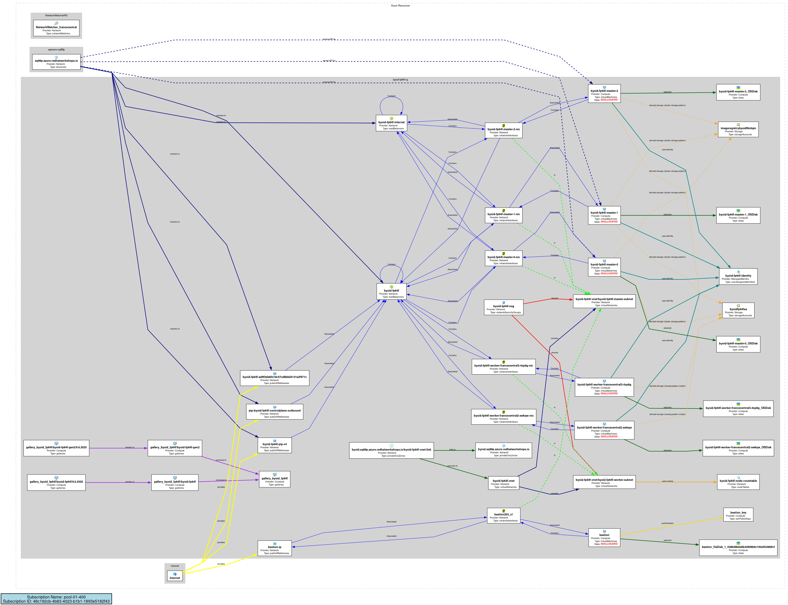
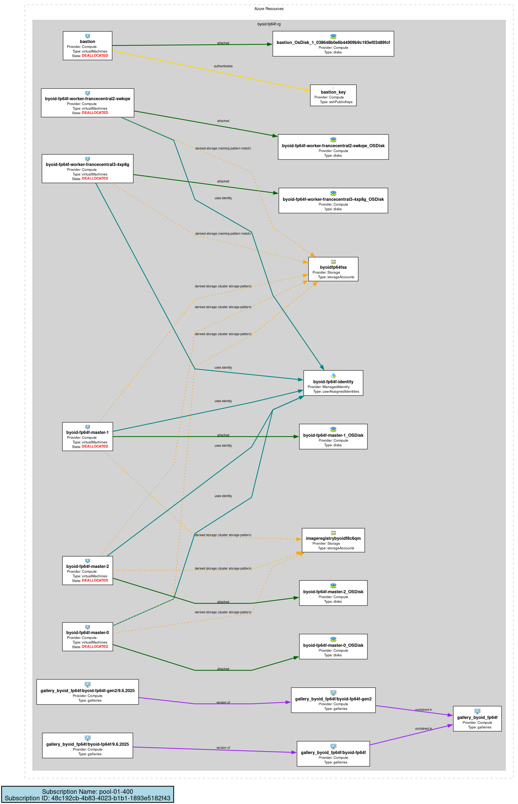

# Python AzViz

A modern Python implementation for automatically generating Azure resource topology diagrams, inspired by the PowerShell [AzViz](https://github.com/PrateekKumarSingh/AzViz) module.

## Overview

Python AzViz generates visual diagrams of Azure Resource Groups and their dependencies by:
- Discovering Azure resources using Azure Management APIs
- Mapping resource relationships and dependencies
- Creating graph visualizations using NetworkX and Graphviz
- Supporting multiple themes and output formats

## Features

- **Azure Resource Discovery**: Automatically finds resources and dependencies
- **Subscription Flexibility**: Support for both subscription IDs and names
- **Network Topology Mapping**: Maps VNets, subnets, and network relationships
- **VM Power State Visualization**: Shows running/stopped status with color coding
- **Visual Themes**: Light, dark, and neon color schemes
- **Multiple Formats**: PNG, SVG, and interactive HTML output support
- **Flexible Filtering**: Include/exclude specific resource types
- **Icon Integration**: 56+ Azure service icons for visual clarity
- **Hybrid Layout**: Horizontal resource groups with vertical resource stacking
- **Advanced Dependencies**: SSH keys, managed identities, gallery hierarchies, DNS zones
- **Private Link Support**: Visualizes Private Endpoints and Private Link Services
- **Cross-Resource Group**: Discovers dependencies across resource groups
- **Storage Account Relationships**: Connects VMs to storage accounts and diagnostics
- **Compute-Only View**: Focus on compute resources and their direct dependencies

## Example Output

### Full Topology View
Shows all Azure resources and their relationships across the subscription:



### Compute-Only View
Focuses on compute resources (VMs, disks, clusters) and their directly related infrastructure:



The compute-only view filters 49 resources down to 21 focused on compute infrastructure, making it easier to understand VM deployments, storage attachments, and networking dependencies.

## Installation

### Prerequisites
- Python 3.8+
- [Graphviz](https://graphviz.org/download/) installed on your system
- Azure CLI or Azure credentials configured

### Install Graphviz
**Ubuntu/Debian:**
```bash
sudo apt-get install graphviz
```

**macOS:**
```bash
brew install graphviz
```

**Windows:**
Download from https://graphviz.org/download/

### Option 1: Install Python AzViz
```bash
pip install python-azviz
```

### Option 2: Run Directly from Source
```bash
# Clone the repository
git clone https://github.com/rut31337/python-azviz.git
cd python-azviz

# Install dependencies
pip install -r requirements.txt

# Run directly using wrapper script
python azviz.py --help
python azviz.py export --resource-group my-rg
python azviz.py list-rg
```

### Option 3: Development Installation
```bash
# Install in editable mode for development
pip install -e .
python-azviz --help
```

## Quick Start

```python
from azviz import AzViz

# Initialize with Azure credentials
viz = AzViz()

# Generate diagram for all resource groups
viz.export_diagram(
    resource_group=[],  # Empty list = all RGs
    output_file="all-resources.png",
    theme="light"
)

# Generate diagram for specific resource group
viz.export_diagram(
    resource_group="my-resource-group",
    output_file="my-diagram.png",
    theme="light"
)
```

### CLI Usage
```bash
# Diagram all resource groups in subscription
python-azviz export --output all-resources.png

# Basic usage for specific resource group
python-azviz export --resource-group my-rg --output diagram.png

# With custom theme and format
python-azviz export --resource-group my-rg --theme dark --format svg --output diagram.svg

# Interactive HTML output
python-azviz export --resource-group my-rg --format html --output diagram.html

# Multiple resource groups
python-azviz export -g rg1 -g rg2 -g rg3 --output multi-rg.png

# Using subscription by name instead of ID
python-azviz export --subscription "My Production Subscription" --output prod.png

# Using subscription by ID
python-azviz export --subscription "12345678-1234-1234-1234-123456789012" --output prod.png

# Focus on compute resources only
python-azviz export --compute-only --output compute-topology.png
python-azviz export --resource-group my-rg --compute-only --output my-compute.png

# Verbose output for debugging (shows Graphviz warnings)
python-azviz export --verbose --resource-group my-rg --output diagram.png
python-azviz export -v --resource-group my-rg --output diagram.png

# List resource groups in specific subscription
python-azviz list-rg --subscription "My Dev Subscription"

# Preview resources before generating diagram
python-azviz preview my-rg --subscription "My Test Subscription"
```

## Configuration

### Subscription Selection
Python AzViz supports flexible subscription targeting:
- **By Name**: `--subscription "My Production Subscription"`
- **By ID**: `--subscription "12345678-1234-1234-1234-123456789012"`
- **Partial Matching**: `--subscription "Production"` (must be unique)
- **Auto-detection**: Uses first available subscription if not specified

### Authentication
Python AzViz supports multiple authentication methods:
- Azure CLI (`az login`)
- Environment variables
- Managed Identity
- Service Principal

### Themes
- `light`: Light background with dark text
- `dark`: Dark background with light text
- `neon`: High-contrast neon colors

### Output Formats
- `png`: Portable Network Graphics
- `svg`: Scalable Vector Graphics
- `html`: Interactive HTML with zoom, pan, and drag capabilities

### Filtering Options
- **Compute-Only**: `--compute-only` focuses on compute resources and their direct dependencies
  - Includes: VMs, disks, SSH keys, galleries, AKS/OpenShift clusters
  - Related: Network interfaces, VNets, subnets, NSGs, load balancers, storage accounts, managed identities
  - Perfect for understanding compute infrastructure deployments
- **Exclude Types**: `--exclude "*.subnets"` to exclude specific resource types

### Verbose Output
- **Normal mode**: Clean output with Graphviz warnings suppressed
- **Verbose mode** (`--verbose` or `-v`): Shows all debug information including Graphviz warnings and processing details

### Supported Azure Resources
Python AzViz automatically discovers and visualizes these Azure resource types with proper relationships:

**Compute**
- Virtual Machines (with power state visualization)
- Virtual Machine Scale Sets
- SSH Public Keys
- Azure Compute Galleries, Images, and Versions

**Network**
- Virtual Networks and Subnets
- Network Interfaces
- Public IP Addresses
- Load Balancers
- Network Security Groups
- Route Tables
- Private Endpoints
- Private Link Services
- DNS Zones (Public and Private)
- Private DNS Zones and VNet Links

**Storage**
- Storage Accounts (with VM diagnostic relationships)
- Managed Disks

**Identity**
- User-Assigned Managed Identities

**Container**
- Azure Red Hat OpenShift Clusters
- Azure Kubernetes Service Clusters

**Other**
- Resource Groups (as containers)
- Cross-resource group dependencies
- Internet connectivity visualization

## Examples

See the `examples/` directory for more usage examples.

## Migration from PowerShell AzViz

Python AzViz maintains compatibility with the original PowerShell version:
- Same parameter names and behavior
- Identical output formats and themes
- Compatible icon system

## Contributing

1. Fork the repository
2. Create a feature branch
3. Make your changes
4. Add tests
5. Submit a pull request

## License

MIT License - see [LICENSE](LICENSE) file for details.

## Credits

- Original PowerShell AzViz by [Prateek Kumar Singh](https://github.com/PrateekKumarSingh/AzViz)
- Python implementation by [Patrick Rutledge](https://github.com/rut31337) with assistance from Claude AI
- Azure service icons from Microsoft's official Azure Architecture Icons
